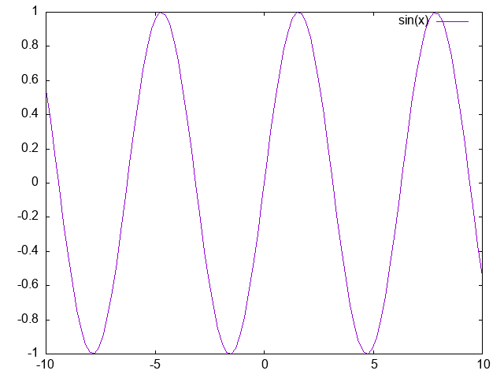

# gnuplot（入門編）

## はじめに

[gnuplot](http://www.gnuplot.info/) はUnixやWindows、Macなどの様々なプラットフォーム上で動く、簡単にデータや関数のプロットができる描画ツールです。
線や点、等高線、ベクトル場などを、2Dおよび3Dで描くことができます。

使い始めると奥が深く様々なことができるのですが、そのためにはいくつかのコマンドを覚える必要があります。
ここでは、その中でも最も基本的なものについて説明をしていきます。
ここに書かれている機能が全てではありませんので、高度なことをやりたい場合はオンラインマニュアル（後述）やインターネット等を参考にするとよいでしょう。
少し古いですが、
[gnuplot tips (not so Frequently Asked Questions)](http://lowrank.net/gnuplot/)
というホームページが参考になります。
[ここ](https://ss.scphys.kyoto-u.ac.jp/person/yonezawa/contents/program/gnuplot/index.html)
にもgnuplotの詳しい解説があります。


なおこのページは、過去の担当者が作成してくださったものをMarkdownに移植し、一部改変したものです。


## gnuplot の起動と終了の仕方（`gnuplot, quit`など）

まず始めに、gnuplotの起動と終了の仕方について説明します。

gnuplotを起動するにはQTerminal等のウィンドウで`gnuplot`と入力します。
すると、画面には次のように表示されます（細かいところはバージョンによって異なります）。
```
$ gnuplot

	G N U P L O T
	Version 5.4 patchlevel 6    last modified 2023-02-09

	Copyright (C) 1986-1993, 1998, 2004, 2007-2023
	Thomas Williams, Colin Kelley and many others

	gnuplot home:     http://www.gnuplot.info
	faq, bugs, etc:   type "help FAQ"
	immediate help:   type "help"  (plot window: hit 'h')

Terminal type is now 'qt'
gnuplot> 
```


gnuplotが起動するとプロンプトが`gnuplot>`に変わります。
これがgnuplotのコマンドラインで、
ここにコマンドを対話的に入力しながら作業を進めます。

`gnuplot>`のプロンプトで使えるコマンドには大きく分けて

- 終了、ファイルの読み込み、保存のためのコマンド（`quit, load, save`等）
- プロット実行のためのコマンド（`plot, replot, splot`等）
- プロットでのパラメータを変更するためのコマンド（`set xrange`等）
- 関数の定義、変数への代入、変数内容の表示、計算のためのコマンド（`f(x)=sin(x)`等）
- shellに関するコマンド（`pwd, !ls`等）

があります。

`quit`か`q`と入力するとgnuplotは終了します。


なお`Terminal type is now 'qt'`というのは、ターミナルの種類が`qt`ですよ、という意味です。
この後別の種類のターミナルが出てきますから、デフォルトが`qt`であることは頭の片隅に置いておいてください。


## 関数を描いてみる（`plot, replot`）

すでに形がわかっている関数を作図してみましょう。
作図するためのコマンドは`plot`です。例えば、
```
gnuplot> plot sin(x)
```
と入力してみましょう。Gnuplotというタイトルのウィンドウが立ち上がり、$y=\sin(x)$のグラフが表示されるはずです。




!!!note
    この時、画面上の制御がプロットウインドウに移ってしまい、キーボードやマウスを動かすとウィンドウが動いてしまいます。
    マウスをターミナルに戻せば、制御もターミナルに戻ります。


このように、関数形がわかっている曲線をグラフにするには
```
 gnuplot> plot <x を変数とする関数>
```
と入力します。


既に作図したグラフに更にグラフを重ねる場合には`replot`を用います。
```
gnuplot> replot 2*cos(x**2)
```
先ほどのグラフに、$y=2\cos(x^2)$のグラフが追加されているはずです。
なお、積は`*`、冪乗は`**`です。


いくつかのグラフを一度に作図したい場合には関数をカンマで区切って横に並べます。
つまり、
```
gnuplot> plot sin(x), 2*cos(x**2)
```
としても同じ結果になります。


単に`plot 2*cos(x**2)`と入力すると、最初にあった$y=\sin(x)$のグラフは消えてしまうので注意して下さい。


ちなみに、gnuplotではコマンドの省略形が用意されています。
`plot`の省略形は`p`、`replot`の省略形は`rep`です。
何度も打つ場合には後者の方がよいでしょう。


## コマンドが分からなくなったら（`help`）
これからgnuplotで使うコマンドのいくつかについて説明をしていきます。
コマンドの数は決して少なくありません。
もしもコマンドの使い方を忘れてしまった場合には
```
gnuplot> help <コマンド名>
```
と入力して下さい。
オンラインマニュアルが（英語で）表示されます。
`help`は`?`でも代用できます。

マニュアルがさらにいくつかのサブトピックについてわかれている場合には、大まかな説明が表示された後で、どのサブトピックについて調べるのかを聞いてきます。
```
gnuplot> ? plot
(大まかな説明)
Subtopic of plot:
```
調べたいサブトピックがあればそれを、これ以上細分化されたマニュアルは必要ないのであれば単にリターンを入力します。

なお、`help`の後のコマンド名を省略した場合にはgnuplotに関する全体的なマニュアルが表示されます。


## 訳が分からなくなったとき（`clear, reset`）
ウィンドウを動かしてしまい、自分が今どこにいるのか分からなくなることがあります。
その場合は
```
gnuplot> clear
```
と入力してください。
ウィンドウがまっさらな状態に戻ります。

また、これから先、様々なコマンド入力していきます。
すると、「今どのコマンドが反映されているのか？」が段々分からなくなってきます。
その場合は
```
gnuplot> reset
```
と入力すると、今まで入力した設定が消えますから、一からやり直すことができます。
