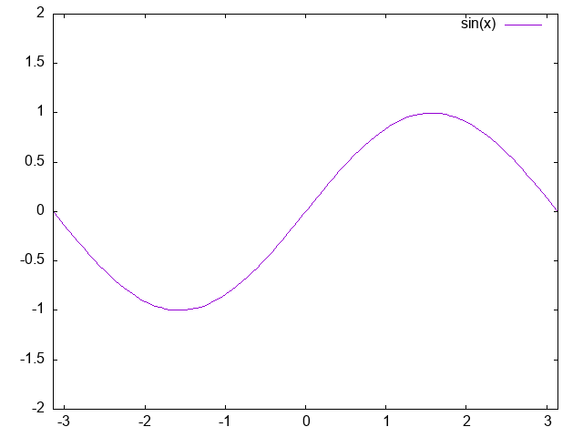
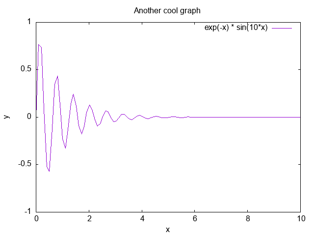

# 基本編
`plot`コマンドを用いてグラフを描けるようになりました。
しかし、まだラベルやタイトルが付いていません。
また、このままではウィンドウにグラフが表示されているだけなので、スライドや文書に貼り付けるためには保存する必要があります。
このページでは、こういった事柄について学習します。


## 細かい図の指定


### 作図範囲を指定する（`set x(y)range, set autoscale`）
作図範囲を指定するには`set xrange`（または`yrange`）コマンドを用います。
例えば、$x$の作図範囲を$-\pi$から$\pi$まで、$y$の作図範囲を$-2$から$2$までにしたい時には、
`plot sin(x)`などの後に
```
gnuplot> set xrange [-pi:pi]
gnuplot> set yrange [-2:2]
```
と入力します。
ただし`set`コマンドは設定を変えるだけですから、画面に表示されているグラフは変化しません。
```
gnuplot> replot
```
と入力すれば、画面に表示されているグラフが更新され、正しいグラフになると思います。



作図範囲の指定を取り消したい場合には
```
gnuplot> set autoscale
```
と入力します。もちろんこの後にも`replot`と入力する必要があります。
以降このテキストでは`replot`の入力は省略しますが、設定を変えた（`set`コマンドを使った）後は必ず`replot`と入力して図に反映させる必要があります。


### 曲線に名前を付ける（`title, set key`）
`plot`コマンドによってグラフを描くと、右上にそれがどういう曲線か表示されます（凡例）。
これを変えるには`plot`コマンドの際に`title`という引数を加えます。
曲線の名前の部分を ' または '' でくくることに注意して下さい。
```
gnuplot> plot sin(x) title 'my cool plot'
```

曲線の名前を表示する必要がない時には
```
gnuplot> plot sin(x) title 'with name', cos(x) notitle
```

のようにします。

凡例の表示場所を設定するには`set key`というコマンドを使います。
ここでは詳しい説明は省略しますので、オンラインマニュアルでその使い方を確かめてみて下さい。


### 描画スタイルを変える（`set style function, with, set grid`）
今まで表示したグラフは連続した曲線で描かれていました。
この表示方法を変えるコマンドとして`set style function`があります。例えば
```
gnuplot> set style function steps
```
としてみましょう。グラフが階段状になるはずです。


段の数（一般にはgnuplotが描画のためにサンプルする点数）を変えるには`set samples`というコマンドを用います。
```
gnuplot> set samples 40
```
とすれば、40段のグラフが描かれます。

グラフの表示はこの他にも、点線`dots`や棒グラフ`boxes`、パルス状のグラフ`impulses`などが使えます。
詳しくは、
```
gnuplot> help set style
```
を見てください。
なお、デフォルトに戻すには`set style function lines`とします。

複数のグラフをそれぞれ異なったスタイルで描きたい場合には、`plot`コマンドの際に`with`をつけて指定します。
例えば
```
gnuplot> plot sin(x) with points, sin(x)*cos(x) with impulses
```
のようにします。

`set grid`コマンドを使うと、$x$ 軸、$y$ 軸それぞれの目盛が刻まれている値の格子が入ります。
格子を消すには`unset grid`とします。


### 軸に名前をつける（`set x(y)label, title`）
$x$軸と$y$軸が何を意味しているのか表示させてみましょう。
これには`set xlabel`（または`ylabel`）を用います。
```
gnuplot> set xlabel 'axis 1' 
gnuplot> set ylabel 'axis 2'
```
グラフ全体の表題を付けるには`set title`です。
```
gnuplot> set title 'super title'
```


### x軸とy軸のスケール（`set size ratio`）
gnuplotでは、縦横のスケールを指定することが可能です。
`set size ratio r`でグラフの横縦の比率が$r$になり、
`set size ratio -r`でy軸の単位長さがx軸の$r$倍になります。

例えば、x軸とy軸のスケールを一致させるには
```
gnuplot> set size ratio -1
```
とします。


### 対数プロット（`set logscale`）
gnuplotでは対数軸の作図も可能です。例えば
```
gnuplot> set logscale y
gnuplot> plot exp(x+1)
```
としてみましょう。$y$軸が対数表示になるはずです。
`logscale`の後を省略した場合には全ての軸が対数軸になります。

対数プロットをやめるには`unset logscale y`とします。


## グラフを保存する（`set terminal postscript, set output`）

作ったグラフを保存してみましょう。
まず、
```
 gnuplot> set terminal
```
を実行してください。
利用可能なターミナルの種類が一覧で出てきます（デフォルトは普通`qt`です）。

ここに`png`や`jpeg`があるか探しましょう。
もしあれば、png/jpegでの出力が可能です。
ない場合は、他の出力形式を検討することになります。
（個人的な意見ですが、pdf出力用の`pdfcairo`はオススメしません。バグることが多いからです）

以下では、pngでの出力方法を説明します。
ここまで色々なコマンドを入力していますから、まず`reset`でまっさらな状態にしておいてから、
`plot sin(x)`しましょう。
次に
```
gnuplot> set terminal png
gnuplot> set output 'output.png'
```
でターミナルをpng用に切り替えるとともに、ファイル名を指定します。
このままでは出力先を指定しただけですから、ファイルには何も書き込まれていません。
そこで
```
gnuplot> replot
```
とします。これで`output.png`にグラフが書き込まれているはずです。

最後に
```
 gnuplot> set output
```
で出力ファイルを閉じ、ターミナルを元へ戻すために
```
 gnuplot> set terminal qt
```
とします。

**注意1 `set output`をしないで他へ出力に切り替える（`set terminal qt`等する）とファイルが壊れることがあります。**

**注意2 「`set terminal png`→`set output 'output.png'`→`plot sin(x)`」の順で作画したが、ファイルに書き込まれない」という事態が起こった方へ：
これも、出力先と描きたいグラフを指定しただけで、書き込むという作業は行われていないためです。
最後に`set output`を行ってください。**


## `plt`ファイルと`load`
ここまではすべて対話方式でコマンドを入力してきましたが、コマンドの数が多くなってくると面倒です。
複数のコマンドをひとつのファイルに書いておき、まとめて実行することができます。


まずファイルを作りましょう。ここでは`ex.plt`とします（一般に`plt`という拡張子を用いる場合が多いです）。
エディタで以下の内容を書いてみてください。
```
set xlabel 'x'
set ylabel 'y'
set title 'Another cool graph'
set xrange [0:10]
set yrange [-1:1]
p exp(-x) * sin(10*x)
```


これらのコマンド群を一気に実行するには`load`というコマンドを使います。
```
gnuplot> load 'ex.plt'
```



以下は筆者の個人的な意見です。
色々なpltファイルを使っていると、お互いの設定が干渉しあって訳の分からないことになります。
例えば、ターミナルの種類をpltファイル内で変えたのを忘れてしまい、
`qt`ターミナルだと思って作業していたら`png`用ターミナルだった、などなど。

これらを防ぐために、pltファイルの先頭や末尾で設定を初期化しておくと安全です。

以下は、pngファイルを作り終わったら`qt`ターミナルに戻る例です。
```
reset
set terminal png
set output "expsin.png"

set xlabel 'x'
set ylabel 'y'
set title 'Another cool graph'
set xrange [0:10]
set yrange [-1:1]
p exp(-x) * sin(10*x)

set terminal qt
reset
```


## `load`と`save`

先ほど`load`というコマンドを学びましたが、この`load`と兄弟関係にあるコマンドが`save`です。
`save`コマンドを用いることで、これまでに対話形式で実行してきたコマンドを先程自分で書いたpltファイルと同様な出力として得られます。
例えば、
```
gnuplot> p cos(x)
gnuplot> set xlabel 'x'
gnuplot> set ylabel 'y'
gnuplot> set terminal postscript
gnuplot> set output 'cos.ps'
gnuplot> rep
gnuplot> save 'cos.plt'
```
としてみましょう。[^1]

[^1]:`ps`とはpostscriptの略です。画像の保存形式の一つと思ってください。


これをエディタで開いてみると、
```
#!/usr/bin/gnuplot -persist
#
#    
#    	G N U P L O T
#    	Version 4.6 patchlevel 6    last modified September 2014
#    	Build System: Linux i686
#    
#    	Copyright (C) 1986-1993, 1998, 2004, 2007-2014
#    	Thomas Williams, Colin Kelley and many others
#    
#    	gnuplot home:     http://www.gnuplot.info
#    	faq, bugs, etc:   type "help FAQ"
#    	immediate help:   type "help"  (plot window: hit 'h')
# set terminal postscript landscape noenhanced defaultplex \
   leveldefault monochrome colortext \
   dashed dashlength 1.0 linewidth 1.0 butt noclip \
   nobackground \
   palfuncparam 2000,0.003 \
   "Helvetica" 14  fontscale 1.0 
# set output 'cos.ps'

（略）

set loadpath 
set fontpath 
set psdir
set fit noerrorvariables noprescale
GNUTERM = "x11"
p cos(x)
#    EOF
```
のように書かれていると思います。

一瞬意味不明に見えるかも知れませんが、これは実際に`gnuplot>`において入力することができるコマンドを並べただけなのです。
自分で打ち込んでない部分（例えばここでは、`set loadpath`など）は、gnuplotが勝手に解釈してデフォルトの環境を出力してくれます。
このファイルを良く見ると、自分で入力した`set title`や`set xlabel`が書き出されていることが分かると思います。
`p cos(x)`は設定された環境が全て反映されるように最後に書かれるようになっています。

このファイルを先ほど学んだ`load`コマンドで読み込めば同じ状況が再現されます。
ただし、`set terminal postscript`や`set output 'cos.ps'`のように、terminalのタイプを変更したり何かを出力したりするコマンドの部分は、`save`で出力したコマンドファイルではコメントアウトされます。
皆さんのファイルでもきっとそうなっていることと思います（コマンドファイルのコメントアウトの最後の部分）。
もし`load`することでpostscriptファイルを作りたければ、この部分のコメントアウトを消したうえで、先ほど学んだ `load`コマンドを用いるかあるいはktermなど普通のターミナル上で
```
$ gnuplot cos.plt
```
と入力することでpostscriptファイルを作ってやることができます。
<!-- 
pltファイルはこれから研究をする上でとても強力な手段となります。
例えば$\sin{x},\sin{2x},\sin{3x}$のグラフを出力したいとします。
この時、いちいちgnuplotを立ち上げて何度も `plot sin(x)` などと打つのは面倒ですよね
（まあ、3つぐらいなら面倒ではないかもしれませんが、$\sin{100 x}$までだとしたらどうでしょう）。
そんな時は、前もってemacsなどで
```
#! /usr/bin/gnuplot
set xrange [0:2*pi]
set yrange [-1:1]
set terminal postscript
set output "sin1x.ps"
p sin(x)
set output "sin2x.ps"
p sin(2*x)
set output "sin3x.ps"
p sin(3*x)
```
と書いておき、sintest.plt等の名前で保存しておきます。次に
```
$ gnuplot sintest.plt
```
とすると、一発で3つのpostscriptファイルができてしまいます。

後から学ぶと思いますが、unixのコマンドを用いれば、 $\sin{x}$ から $\sin{100x}$ まで出力するようなコマンドファイルだって簡単に作れてしまいます。
unix(シェル)とコマンドファイルのコンビネーションによって、gnuplotは非常に強力なアイテムになります。


「そんなことしないよ。」と思っている人がいるかもしれません。
しかし、研究をしていく上でこういったことは意外と良くあります。
例えば、「数値計算を行って10秒ごとにデータを取り、それを全てグラフにして時間発展を見たい!」と思った時にこの技が大変役に立ちます。 -->

