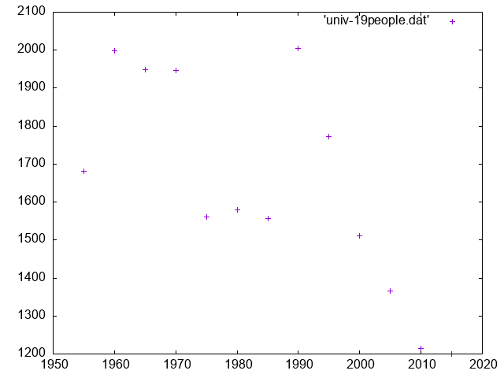
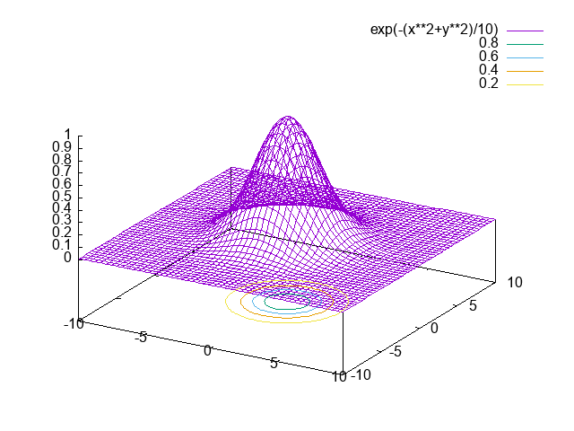
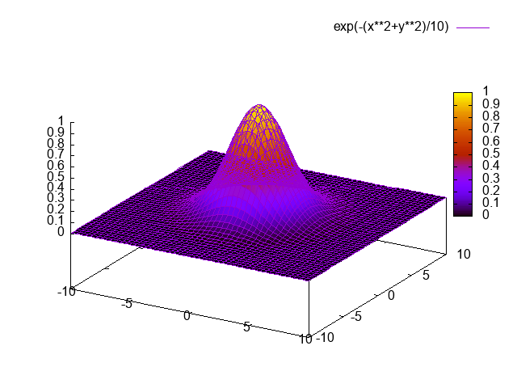
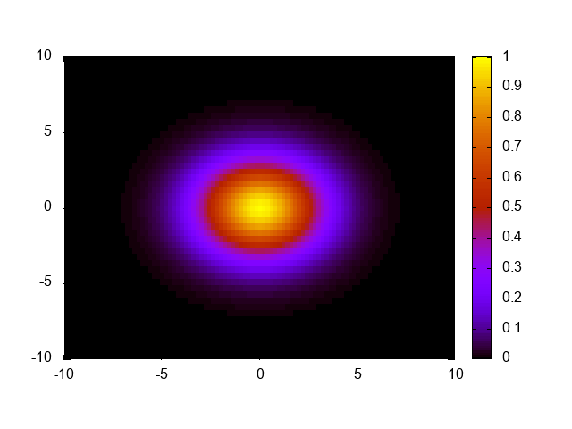

# 応用編


## ファイルからデータを読み込む（`using, every`）

グラフを表示したいのは形がわかっている関数ばかりではありません。
ファイルに保存してあるデータを読み込んでそれをグラフにする時も当然あるでしょう。
これにもやはり`plot`コマンドを用います。
```
gnuplot> plot 'データファイルの名前'
```
のように、データファイルの名前（絶対パスor相対パス）を ' または '' でくくってやります。
データファイルは一つ以上のスペースで区切られた $(x,y(,z...))$ の組が複数行から成るものとします。
以下の`univ-19people.dat`というファイルを例に説明します．
```
# 大学入学人数 (千人)
#  年  18歳人口 入学者人数
  1955  1,682    136
  1960  1,998    167
  1965  1.948    250
  1970  1,947    333
  1975  1,561    424
  1980  1,580    412
  1985  1,556    412
  1990  2,005    492
  1995  1,773    569
  2000  1,511    600
  2005  1,365    604
  2010  1,214    619
  2015  1,200    618
```
最初の2行の冒頭に＃が付いています．これをコメントまたはコメントアウトと言い，
＃を含む行の＃以降はグラフには反映されません。
後で見た時にそれが何のデータだったのかわかるような解説を書いておくと良いでしょう。

さて，`reset`等でこれまでの設定を無効にしておいてから，
```
gnuplot> plot 'univ-19people.dat'
```
と入力してみましょう．
次のようなグラフが出力されます．



データファイルに書かれているデータが複数列ある時、特に何も指定しなければ、1列目が$x$軸、2列目が$y$軸とみなされます。  

列を指定してプロットする場合には、`plot`コマンドに`using`という引数を付けます。
例えば1列目のデータを$x$軸、3列目のデータを$y$軸にとってグラフを描く場合には
```
gnuplot> plot 'univ-19people.dat' using 1:3
```
のようにします。

また、`using`はそれぞれのデータの各列に対応した値を列番号に`$`をつけて表すことができます。
例えば1列目のデータは`$1`、2列目のデータは`$2`で表されます。
これを利用することによって、各列のデータをgnuplot上で演算してグラフに表示させることができます。

例として、上の「18歳人口と大学入学人数」のデータにおいて2行目（18歳人口）と3行目（入学者数）の演算で「大学入学者数の18歳人口に対する比率」という値をグラフ表示させることができます。
この場合の書式は次のようになります。


```
gnuplot> p 'univ-19people.dat' using 1:(100*$3/$2) w l
```
なお`w l`は`with lines`の省略形です。


デフォルトでは，スタイルは`points`になります。
これを変更する場合には
```
gnuplot> set style data lines
```
のように設定しておくか、もしくは
```
gnuplot> plot 'univ-19people.dat' with line
```
のように、毎回スタイルを指定します

なお、スタイルとして`lines(points)`を設定した場合でも、データファイルが空行（何も書かれていない行）を含んでいると、空行の直前のデータと直後のデータの間には線は引かれません。


### 軸の目盛をかえる（`set x(y)tics`）

データファイルで使っている単位と、描きたいグラフの単位が異なっていることはよくあることです。
このような場合には`set xtics`（または`ytics`）コマンドを使って目盛の振り方を変更します。
`univ-19people.dat`の1列目は西暦表示となっていますが、これを元号に直すには以下のようにします。
```
gnuplot> set xtics('S25' 1950, ' ' 1955,  'S35' 1960, ' ' 1965, 'S45' 1970, ' ' 1975, 'S55' 1980, ' ' 1985,  'H02' 1990, ' ' 1995, 'H12' 2000, ' ' 2005,  'H22' 2010, ' ' 2015, 'R2' 2020)
```
これで、
1950, 1960, 1970, 1980, 1990, 2000, 2010, 2020 の位置にはそれぞれ S25, S35, S45, S55, H02, H12, H22, R2 という目盛が振られ、
1955, 1965, 1975, 1985, 1995, 2005, 2015 の位置には何も書かれていない目盛が刻まれます。
$y$軸に目盛を入れる場合も同様です。


目盛りの値には元ファイルの値を用いつつ目盛りの間隔を変更したい場合には、`set xtics <刻み幅>`とします。
引数なしに単に`set xtics`とした場合には、目盛は標準（自動指定）のものに戻ります。
目盛が不要の場合には`unset tics`とします。
また、`xtics font "フォント名,フォントサイズ"`とすればフォントサイズや種類を変えることができます。
デフォルトのフォントサイズは小さめなので、スライド用のグラフを作成するときなどはこれを使用して目盛を読み取りやすくしましょう。
普段は表示されていませんが小目盛の設定もでき、`mxtics <分割数>`とすると小目盛の数を変更できます。


## 3次元プロット
gnuplotでは3次元のグラフも作成することができます。

### 3次元プロット（`splot, set view`）
3次元プロットする際には`splot`というコマンドを使います。

```
gnuplot> splot exp(-(x**2+y**2)/10)
```


デフォルトでは視点の位置は$x$軸から$60^{\circ}$、$z$軸から$30^{\circ}$の地点になります。
これを変更するには`set view`コマンドを用います。
```
gnuplot> set view 50,60
```
とすれば、画面水平右向きが$x$軸、鉛直上向きが$y$軸、画面手前向きが$z$軸であった座標系を、$x$軸の周りに$50^{\circ}$、$z$軸の周りに$60^{\circ}$それぞれ回転させたグラフの画面への投射像が得られます。
また、最近のgnuplotではマウスで図を回転させることも可能です。


また，このままではメッシュ数が少なすぎて，あまり立体感がありません．
そこで
```
gnuplot> set isosamples 50
```
としてみてください．
デフォルトではx,yともに10分割だったものが，かなり細かく描画されていることが分かります．


### コンタープロット（`set contour(surface), set contrparam`）

コンタープロットとは等高線地図を描くことです。
等高線地図を描くには3次元データをプロットする時に
```
gnuplot> set contour
```
と設定します。
すると、$xy$平面上に等高線地図が描かれます。




等高線を描く際の様々なパラメタ（等高線を描く際の近似の仕方、等高線の開始値、幅、終了値等）を変更するには`cntrparam`の値を設定します。
例えば
```
gnuplot> set cntrparam levels incremental 0,0.5
```
とすると、0から開始して0.5刻みで等高線が描かれます。
詳しくは`cntrparam`のオンラインマニュアルを見て下さい。


### カラーのグラデーション表示にする（`set pm3d`）
三次元の図をカラーのグラデーションにする方法として`pm3d`というものがあります。
```
gnuplot> set pm3d
```
としてから三次元プロットを作ると以下のようにグラデーションを用いたものとなります。



ちなみに、このモードをやめるときは
```
gnuplot> unset pm3d
```
とすればもとのモードになります。

グラフの曲面を描かず，等高線のみを$xy$平面に投影したい，という場合があるでしょう．
その場合には`set pm3d map`としておきます．
```
gnuplot> set pm3d map
gnuplot> splot exp(-(x**2+y**2)/10)
```




### データを読み込んで3Dプロットを作る

データファイルから値を読み込んで3次元プロットを作ることもできます．
2次元との違いは，3次元データなので3列のデータを用意しなければならない点です．
例えば
```
# x y z 
  0 0 0 
  0 1 1
  0 2 4 
  0 3 9 
  1 0 1 
  1 1 2 
  1 2 5 
  1 3 10 
  2 0 2 
  2 1 3 
  2 2 6 
  2 3 11 
  3 0 3 
  3 1 4 
  3 2 7 
  3 3 12 
```
というファイル（`data3d.dat`）があったとすると，`plot`コマンド同様
```
gnuplot> splot 'data3d.dat'
```
とすればよいです
（注：バージョンによっては`splot`の前に`set parametric`を設定しなければならないかもしれません）。
`with line`をつければ線画になります．


ファイルに空行で区切られた同数のデータが複数書かれている場合、スタイルとして`lines`（`points`）を指定するとデータを格子上に結んだグラフが描かれます。

